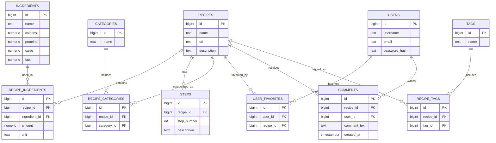

# FoodScope: See Beyond the Plate

## Idea principal
Crear una herramienta de sugerencias de recetas con un input visual de predicción de ingredientes, con llamadas a una BBDD de recetas con detalles de estas e información sobre sus ingredientes. Incluiría información nutricional para complementar al sistema de recomendación y credenciales de usuario para crear un sistema más completo colaborativo.

---

## Estructura del Proyecto

### 1. Scraping
- **Scrapy**:

    Usar scrapy para diseñar crawlers capaces de scrapear páginas de recetas individualmente. Páginas como [allrecipes](https://www.allrecipes.com/) o [seriouseats](https://www.seriouseats.com/).

- **APIs**:

    Usar APIs como la API de [tasty](https://tasty.co/) o [yummly](https://www.yummly.com/) para extraer la información de las recetas.
 
Estos dos métodos permitirán obtener datos más diversos de diferentes fuentes. Las APIs están limitadas a las que estén disponibles, mientras que usando webscraping se podría extraer información de cualquier página de receta existente.

### 2. Tratar Datos
- A partir de la información de las APIs, seguir la estructura del json para extraer la información útil y almacenarla en distintos dataframes.

- A partir de la información del webscraping, normalizar y limpiar el contenido, estructurarlos en dataframes e igualar la información con la obtenida en APIs.

- **Traducción y Normalización**:
    - Traducir recetas e ingredientes al idioma estándar definido para la base de datos (por ejemplo, español o inglés).
    - Unificar formatos y nomenclaturas para ingredientes, cantidades y unidades, asegurando consistencia en los datos procesados.

Con ambas fuentes se obtendrán los diferentes ingredientes disponibles en las recetas, los cuales comformarán su propio dataframe, donde incluiremos:

- Nombre del ingrediente
- Información nutricional, extraída por herramientas como EDAMAM API, la cual permite obtener los datos nutricionales de los ingredientes.

A partir de aquí se calcularían índices de salud para cada receta, el cual nos servirá para categorizar cada una de estas.

### 3. Cargar Datos
Crearemos una BBDD en PostgreSQL, donde cargaremos toda la información de cada tabla que hayamos creado. 

### 4. Computer Vision
- **Segment Anything Model (SAM)** y **DINO/YOLO**:
    - Desarrollar modelos de visión computacional capaces de detectar ingredientes a partir de imágenes, ya sea de un frigorífico, una mesa u otros entornos.
    - SAM será utilizado para segmentar las imágenes y DINO/YOLO se encargará de clasificar los ingredientes detectados.

### 5. Sistema de Recomendación
- **Basado en Contenido**:
    - Utilizar las características de las recetas (ingredientes, valores nutricionales, categorías) para sugerir recetas relevantes al usuario.
- **Colaborativo**:
    - Incorporar la interacción de los usuarios (favoritos, valoraciones) para mejorar las recomendaciones.

El sistema combinará ambos enfoques para ofrecer sugerencias personalizadas, considerando tanto las preferencias explícitas del usuario como los datos colectivos de la plataforma.

### 6. Aplicación Android
- Integrar todas las funcionalidades anteriores en una aplicación móvil accesible desde cualquier dispositivo Android.
- Funcionalidades clave:
    - Subida de imágenes para reconocimiento de ingredientes.
    - Visualización de recetas sugeridas y su información nutricional.
    - Sistema de favoritos y comentarios para colaboración entre usuarios.
    - Generación automática de listas de compras.
